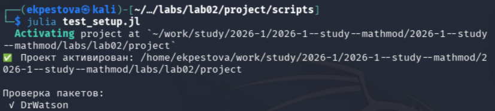
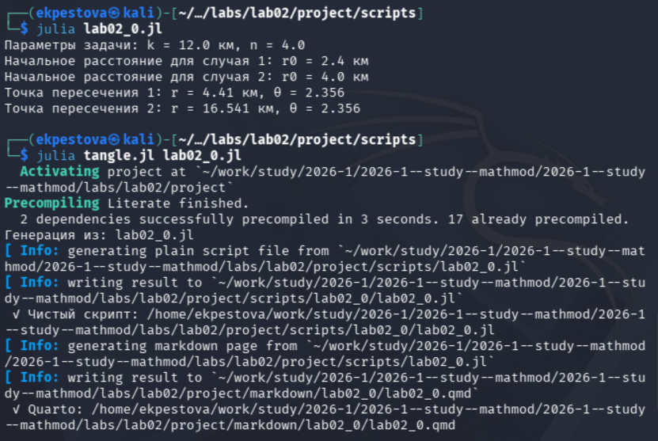
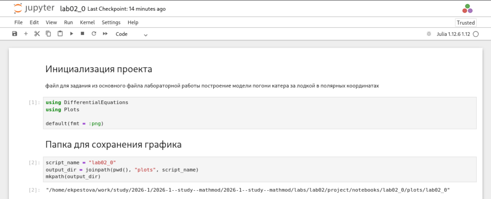
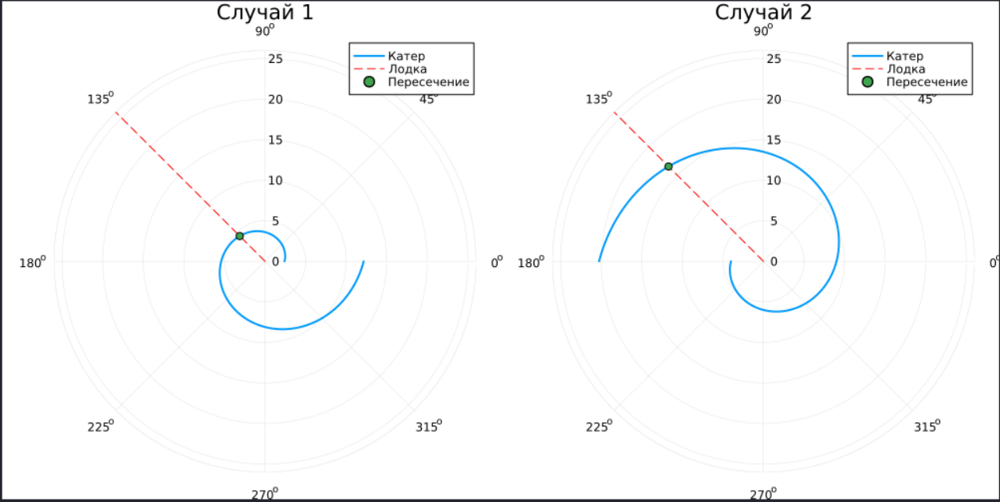
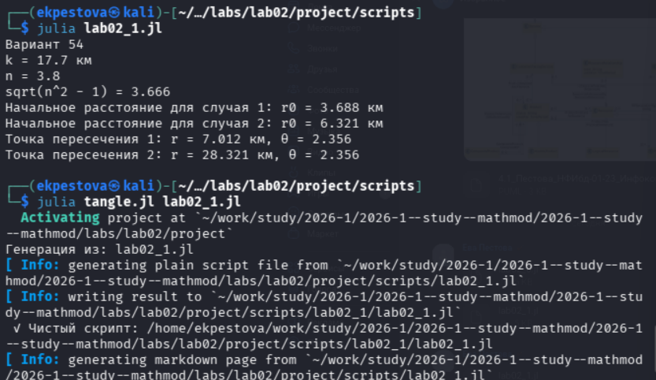
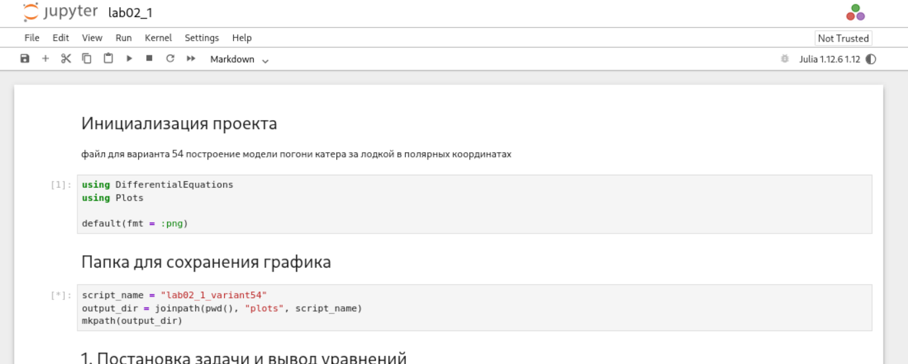
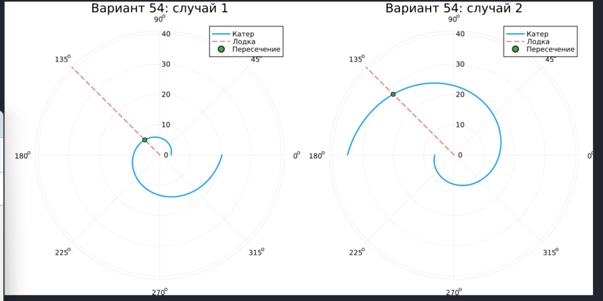

---
## Author
author:
  name: Пестова Ева Константиновна
  email: 1132236053@rudn.ru
  affiliation:
    - name: Российский университет дружбы народов
      country: Российская Федерация
      postal-code: 117198
      city: Москва
      address: ул. Миклухо-Маклая, д. 6

## Title
title: "Отчёт по лабораторной работе №2"
subtitle: "Математическое моделирование"
license: "CC BY"
---

# Цель работы

Изучить построение математической модели задачи о погоне, вывести дифференциальные уравнения движения катера при заданном отношении скоростей и построить траектории движения катера и лодки для определения точки их пересечения.  

# Выполнение лабораторной работы

Создаем и проверяем структуру рабочего каталога project ([рис. @fig-001]).

{#fig-001 width=70%}

Создадим файл для решения задачи из лабораторной и создадим производные форматы ([рис. @fig-002]).

{#fig-002 width=70%}

Просмотрим jupyter notebook и запустим его ячейки ([рис. @fig-003]).

{#fig-003 width=70%}

Откроем результирующий график в каталоге plots ([рис. @fig-004]).

{#fig-004 width=70%}

Аналогичным образом создадим файл для решения второй задачи (вариант 54) и создадим производные форматы ([рис. @fig-005]).

{#fig-005 width=70%}

Просмотрим jupyter notebook и запустим его ячейки ([рис. @fig-006]).

{#fig-006 width=70%}

Также откроем результирующий график в каталоге plots ([рис. @fig-007]).

{#fig-007 width=70%}

# Задача №1



# Задача №2



# Выводы

В ходе работы я научилась формулировать задачу движения в полярных координатах, выводить дифференциальное уравнение траектории и использовать его для графического моделирования движения объектов.  
