---
## Author
author:
  name: Пестова Ева Константиновна
  email: 1132236053@rudn.ru
  affiliation:
    - name: Российский университет дружбы народов
      country: Российская Федерация
      postal-code: 117198
      city: Москва
      address: ул. Миклухо-Маклая, д. 6
## Title
title: Лабораторная раота №4
subtitle: Математическое моделирование
license: CC BY
date: 2026-01-01
date-format: "YYYY-MM-DD" 
---

---
## Author
author:
  name: Пестова Ева Константиновна
  email: 1132236053@rudn.ru
  affiliation:
    - name: Российский университет дружбы народов
      country: Российская Федерация
      postal-code: 117198
      city: Москва
      address: ул. Миклухо-Маклая, д. 6

## Title
title: "Отчёт по лабораторной работе №4"
subtitle: "Математическое моделирование"
license: "CC BY"
---

# Цель работы

Изучить модель гармонического осциллятора и построить решения для колебаний без затухания, с затуханием и под действием внешней силы.  

## Выполнение лабораторной работы

Создаем и проверяем структуру рабочего каталога project ([рис. @fig-001]).

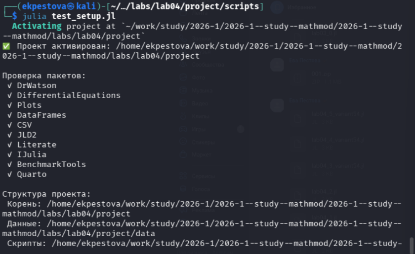{#fig-001 width=70%}

## Задача 1

Создадим файл для решения задачи из лабораторной и создадим производные форматы ([рис. @fig-002]).

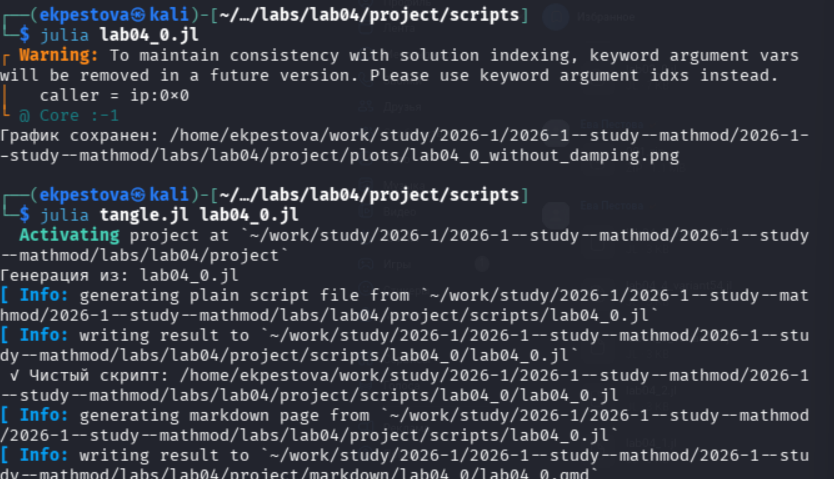{#fig-002 width=70%}

## Задача 1

Просмотрим jupyter notebook и запустим его ячейки ([рис. @fig-003]).

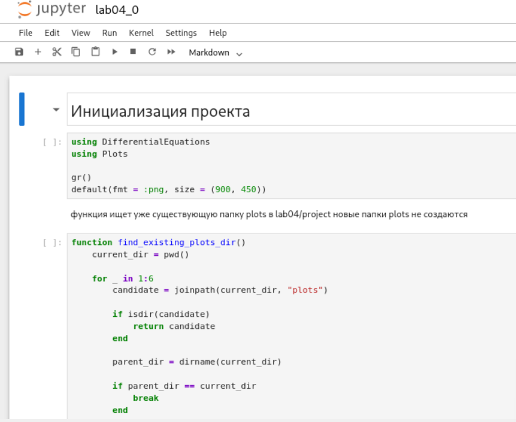{#fig-003 width=70%}

## Задача 1

Откроем результирующий график в каталоге plots ([рис. @fig-004]).

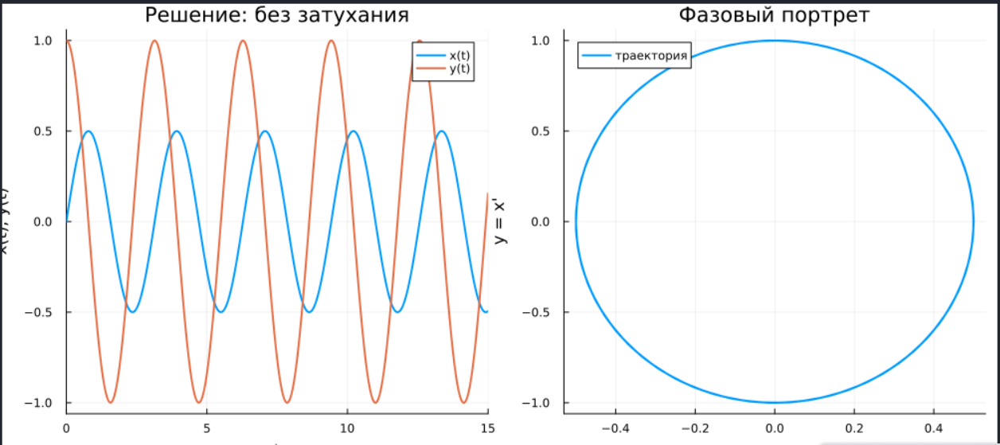{#fig-004 width=70%}

## Задача 2

Создадим файл для решения задачи из лабораторной и создадим производные форматы ([рис. @fig-005]).

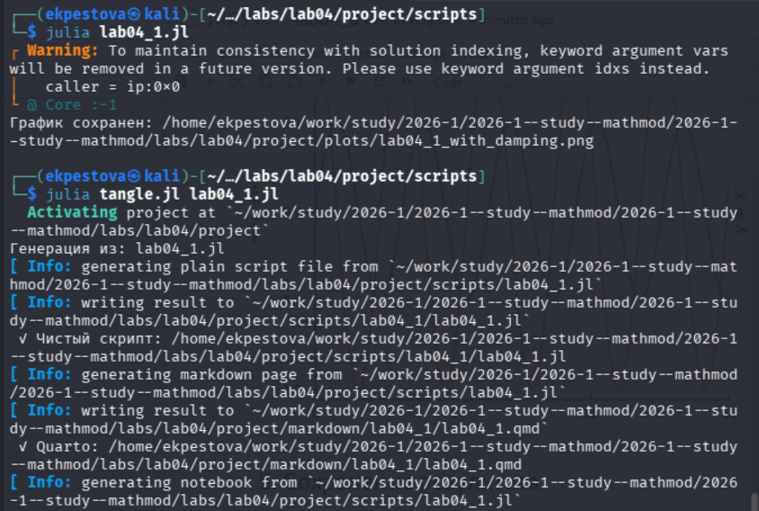{#fig-005 width=70%}

## Задача 2

Просмотрим jupyter notebook и запустим его ячейки ([рис. @fig-006]).

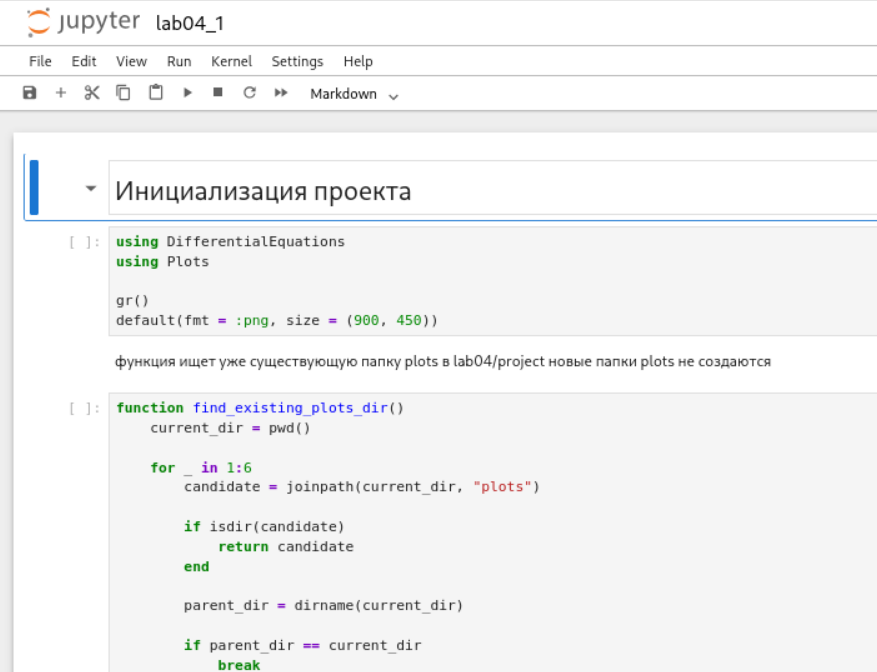{#fig-006 width=70%}

## Задача 2

Откроем результирующий график в каталоге plots ([рис. @fig-007]).

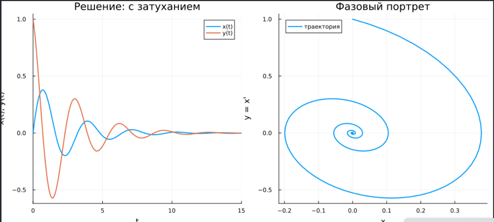{#fig-007 width=70%}

## Задача 3

Создадим файл для решения задачи из лабораторной и создадим производные форматы ([рис. @fig-008]).

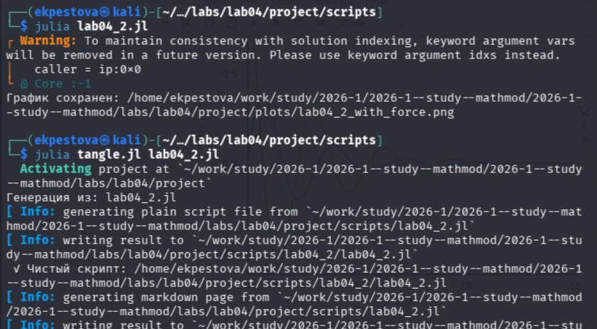{#fig-008 width=70%}

## Задача 3

Просмотрим jupyter notebook и запустим его ячейки ([рис. @fig-009]).

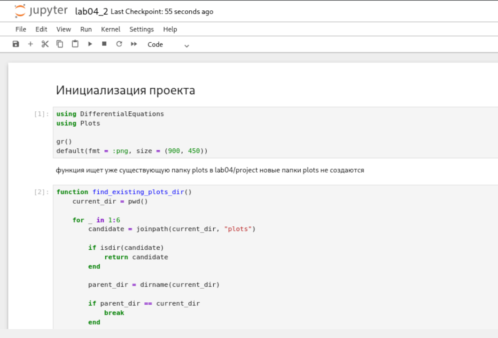{#fig-009 width=70%}

## Задача 3

Откроем результирующий график в каталоге plots ([рис. @fig-010]).

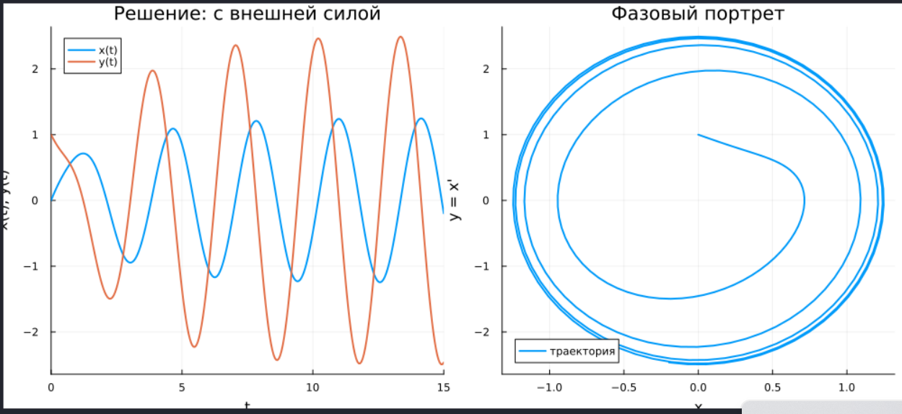{#fig-010 width=70%}

## Задача 4

Аналогичным образом создадим файл для решения следующей задачи (вариант 54) и создадим производные форматы ([рис. @fig-011]).

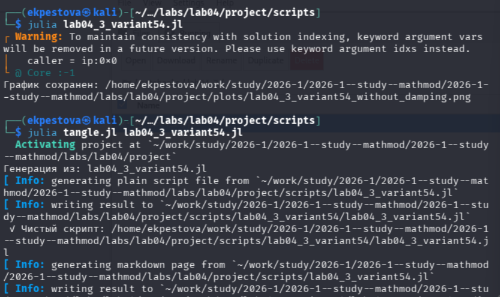{#fig-011 width=70%}

## Задача 4

Просмотрим jupyter notebook и запустим его ячейки ([рис. @fig-012]).

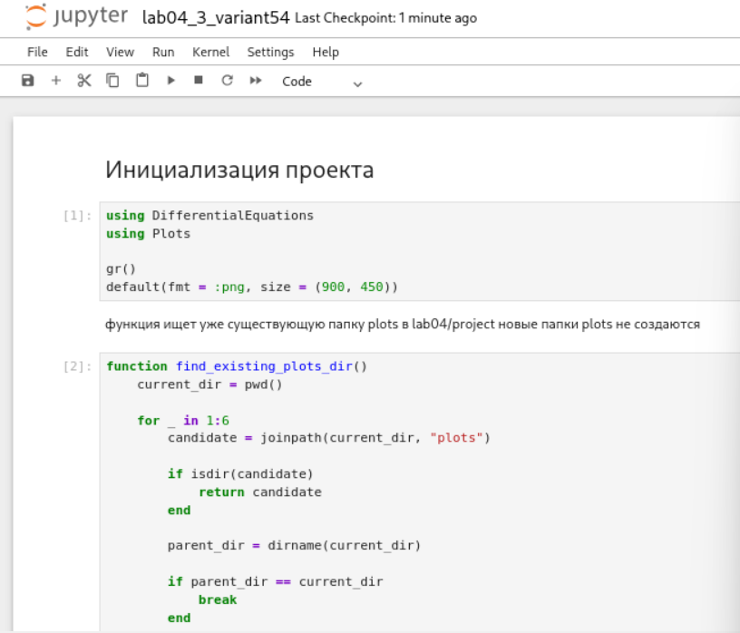{#fig-012 width=70%}

## Задача 4

Также откроем результирующий график в каталоге plots ([рис. @fig-013]).

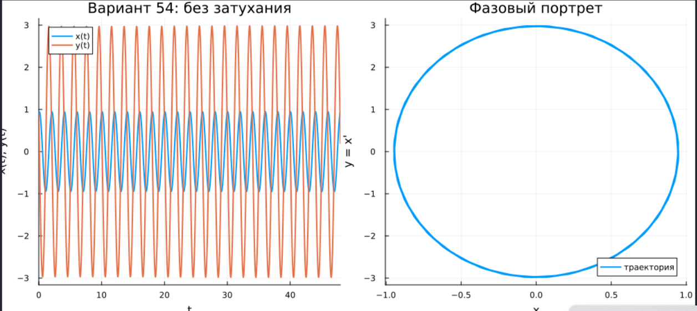{#fig-013 width=70%}

## Задача 5

Аналогичным образом создадим файл для решения следующей задачи (вариант 54) и создадим производные форматы ([рис. @fig-014]).

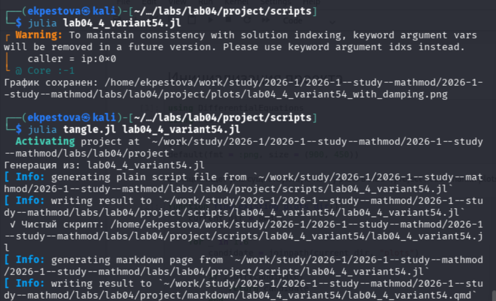{#fig-014 width=70%}

## Задача 5

Просмотрим jupyter notebook и запустим его ячейки ([рис. @fig-015]).

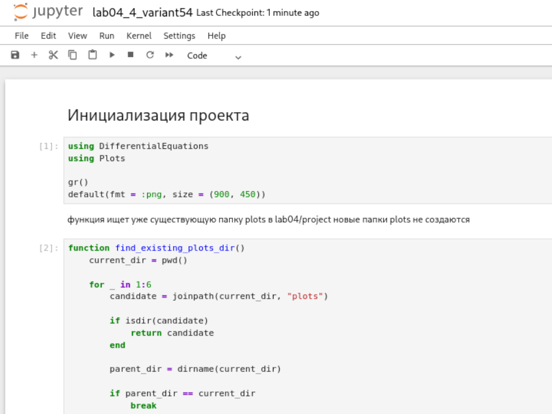{#fig-015 width=70%}

## Задача 5

Также откроем результирующий график в каталоге plots ([рис. @fig-016]).

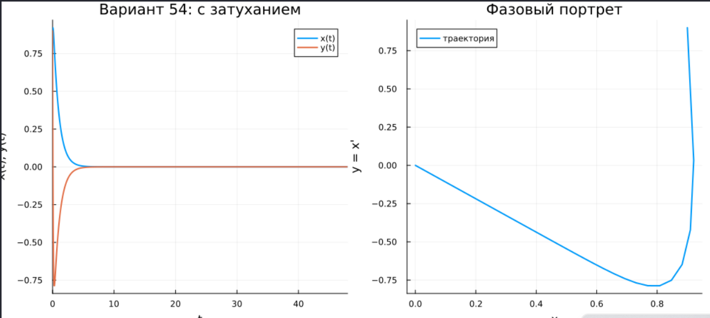{#fig-016 width=70%}

## Задача 6

Аналогичным образом создадим файл для решения следующей задачи (вариант 54) и создадим производные форматы ([рис. @fig-017]).

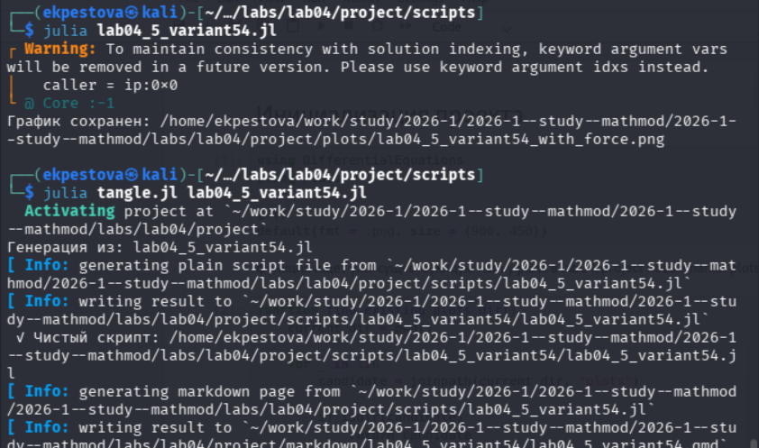{#fig-017 width=70%}

## Задача 6

Просмотрим jupyter notebook и запустим его ячейки ([рис. @fig-018]).

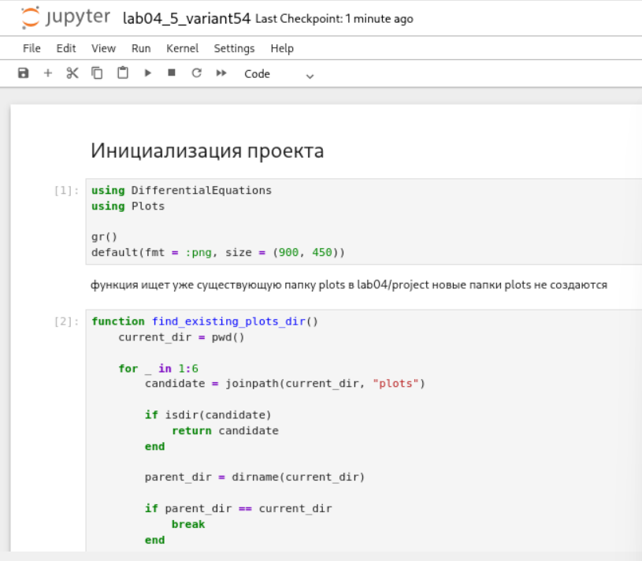{#fig-018 width=70%}

## Задача 6

Также откроем результирующий график в каталоге plots ([рис. @fig-019]).

{#fig-019 width=70%}

## Выводы

В ходе работы я научилась решать уравнения гармонических колебаний, строить графики решений и фазовые портреты для разных типов колебательных систем.    
