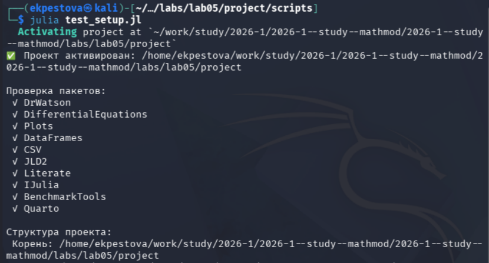
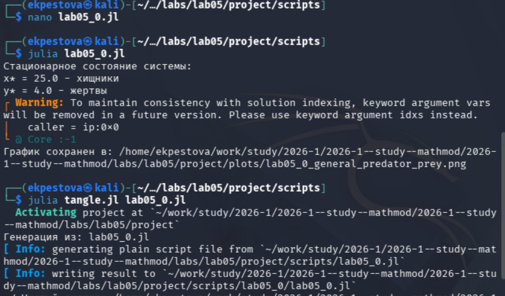
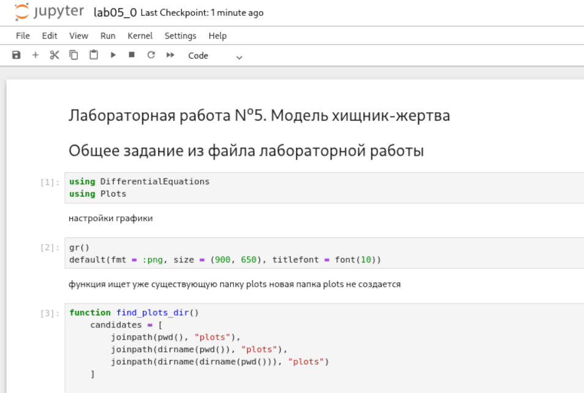
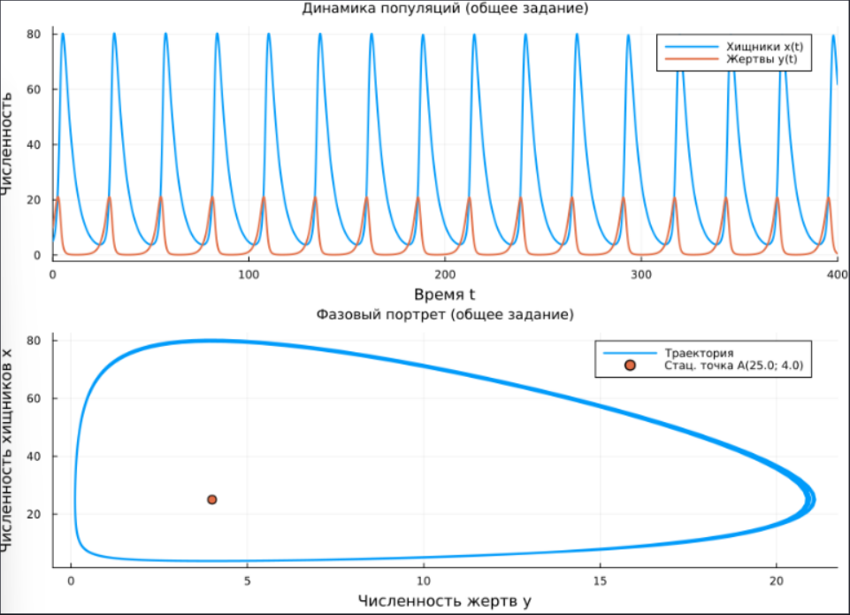
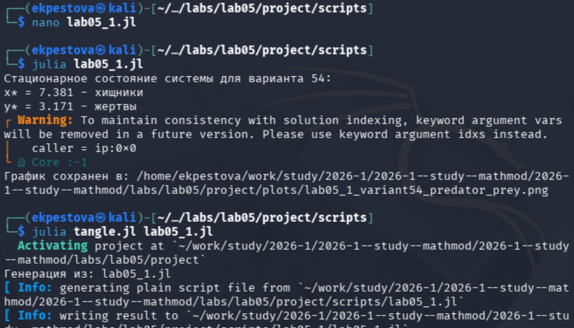
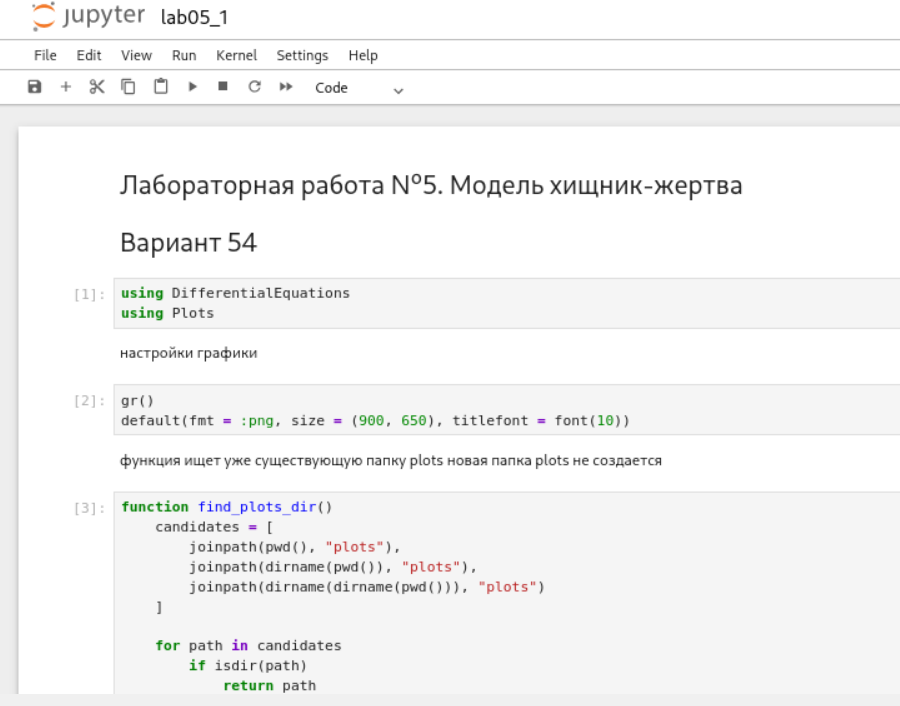
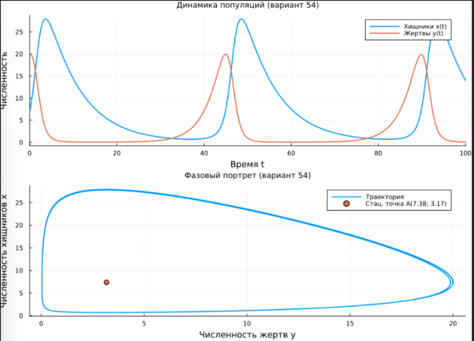

---
## Author
author:
  name: Пестова Ева Константиновна
  email: 1132236053@rudn.ru
  affiliation:
    - name: Российский университет дружбы народов
      country: Российская Федерация
      postal-code: 117198
      city: Москва
      address: ул. Миклухо-Маклая, д. 6
## Title
title: Лабораторная работа №5
subtitle: Математическое моделирование
license: CC BY
date: 2026-01-01
date-format: "YYYY-MM-DD" 
---

## Цель работы

Изучить модель "хищник-жертва" и построить графики изменения численности популяций волков и зайцев.  

## Выполнение лабораторной работы

Создаем и проверяем структуру рабочего каталога project ([рис. @fig-001]).

{#fig-001 width=70%}

## Выполнение лабораторной работы

Создадим файл для решения задачи из лабораторной и создадим производные форматы ([рис. @fig-002]).

{#fig-002 width=70%}

## Выполнение лабораторной работы

Просмотрим jupyter notebook и запустим его ячейки ([рис. @fig-003]).

{#fig-003 width=70%}

## Выполнение лабораторной работы

Откроем результирующий график в каталоге plots ([рис. @fig-004]).

{#fig-004 width=70%}

## Выполнение лабораторной работы

Аналогичным образом создадим файл для решения второй задачи (вариант 54) и создадим производные форматы ([рис. @fig-005]).

{#fig-005 width=70%}

## Выполнение лабораторной работы

Просмотрим jupyter notebook и запустим его ячейки ([рис. @fig-006]).

{#fig-006 width=70%}

## Выполнение лабораторной работы

Также откроем результирующий график в каталоге plots ([рис. @fig-007]).

{#fig-007 width=70%}

## Выводы

В ходе работы я научилась моделировать взаимодействие двух популяций, строить фазовый портрет системы и находить ее стационарное состояние.   
