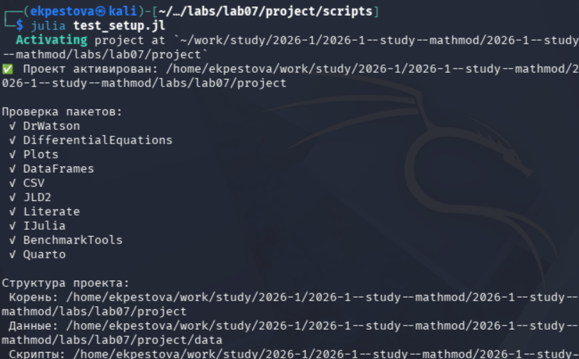
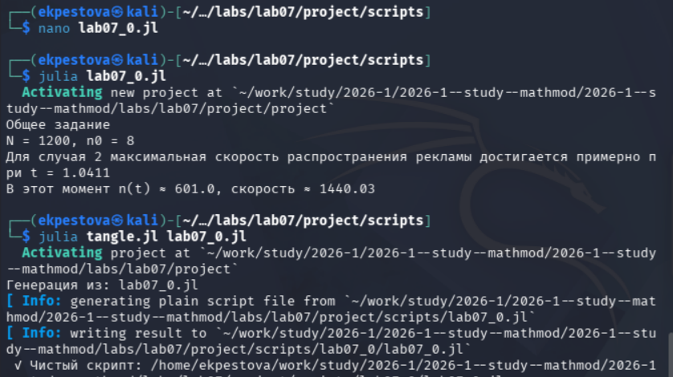
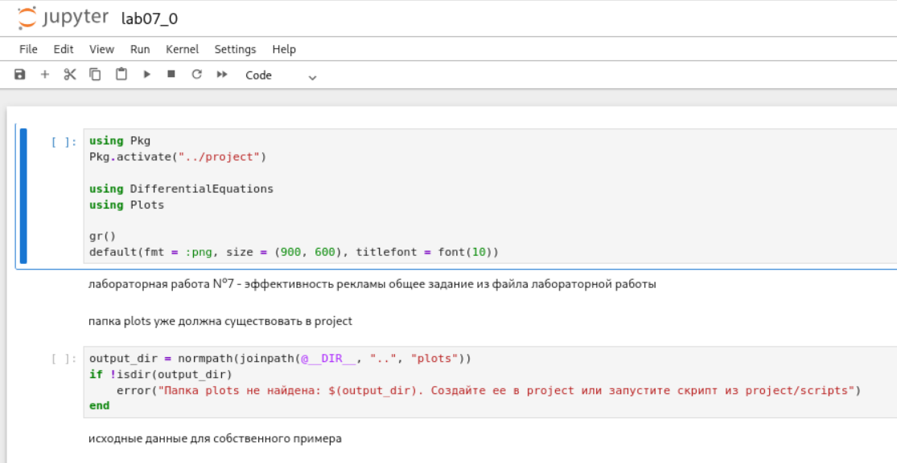
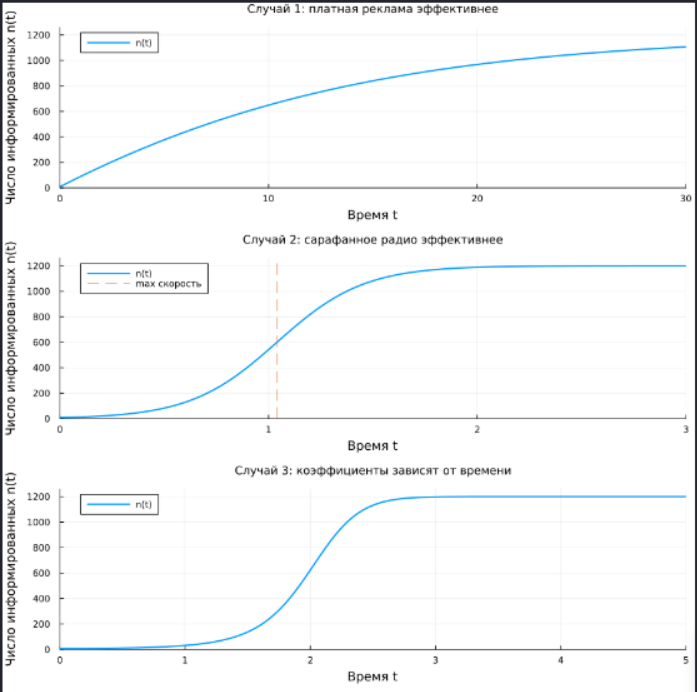
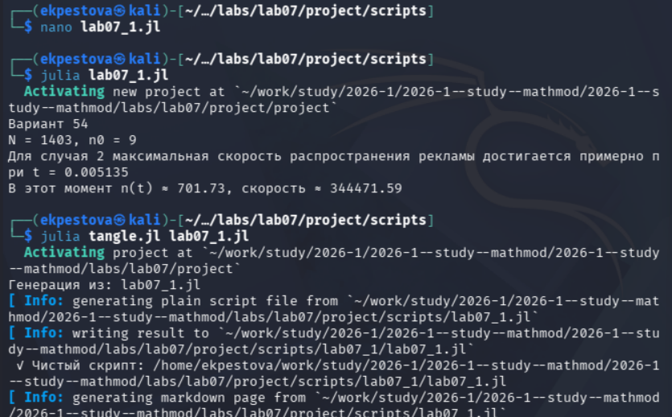
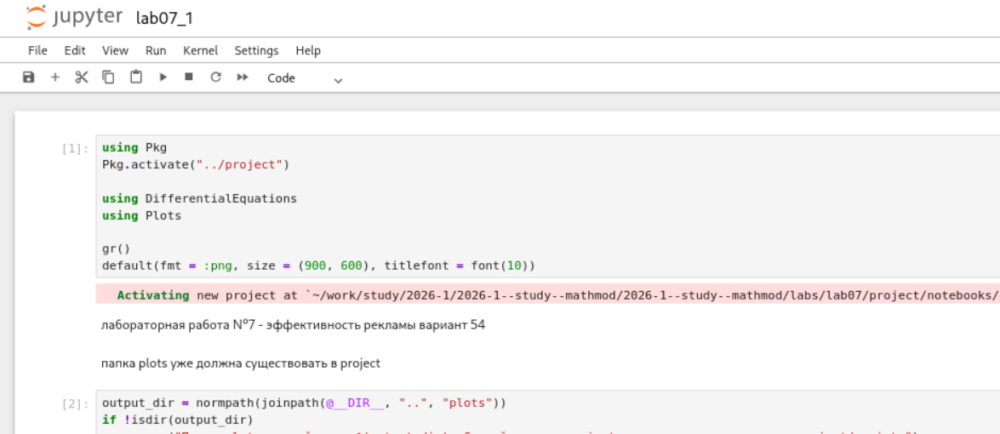
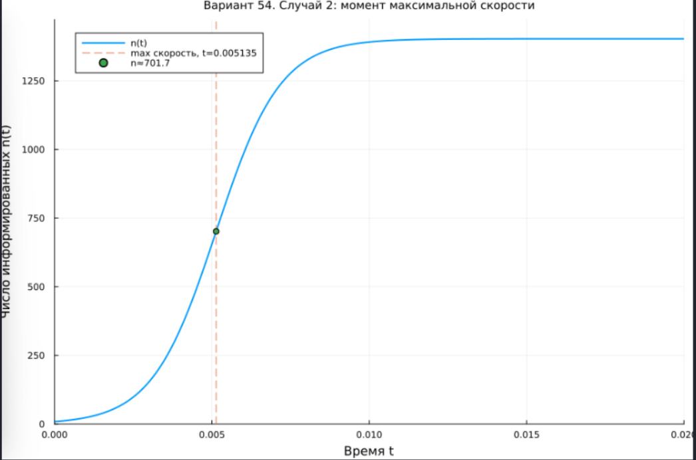

---
## Author
author:
  name: Пестова Ева Константиновна
  email: 1132236053@rudn.ru
  affiliation:
    - name: Российский университет дружбы народов
      country: Российская Федерация
      postal-code: 117198
      city: Москва
      address: ул. Миклухо-Маклая, д. 6
## Title
title: Лабораторная работа №7
subtitle: Математическое моделирование
license: CC BY
date: 2026-01-01
date-format: "YYYY-MM-DD" 
---

## Цель работы

Изучить модель распространения рекламы и сравнить влияние платной рекламы и "сарафанного радио" на рост числа информированных клиентов.  

## Выполнение лабораторной работы

Создаем и проверяем структуру рабочего каталога project ([рис. @fig-001]).

{#fig-001 width=70%}

## Выполнение лабораторной работы

Создадим файл для решения задачи из лабораторной и создадим производные форматы ([рис. @fig-002]).

{#fig-002 width=70%}

## Выполнение лабораторной работы

Просмотрим jupyter notebook и запустим его ячейки ([рис. @fig-003]).

{#fig-003 width=70%}

## Выполнение лабораторной работы

Откроем результирующие графики в каталоге plots ([рис. @fig-004]).

{#fig-004 width=70%}

## Выполнение лабораторной работы

Аналогичным образом создадим файл для решения второй задачи (вариант 54) и создадим производные форматы ([рис. @fig-006]).

{#fig-006 width=70%}

## Выполнение лабораторной работы

Просмотрим jupyter notebook и запустим его ячейки ([рис. @fig-007]).

{#fig-007 width=70%}

## Выполнение лабораторной работы

Также откроем результирующие графики в каталоге plots ([рис. @fig-008]).

{#fig-008 width=70%}

## Выводы

В ходе работы я научилась строить графики распространения информации о товаре и определять, при каких условиях реклама становится болеее эффективной.   
